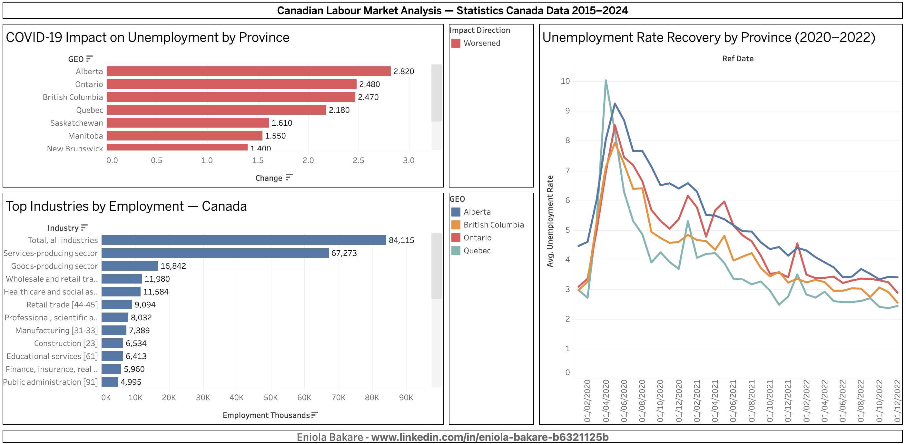

# Canadian Labour Market SQL Analysis

SQL analysis of Statistics Canada Labour Force Survey data examining 
unemployment trends, COVID-19 impact, and employment by industry across 
Canadian provinces (2015–2024).

## Live Dashboard

[View on Tableau Public]-
https://public.tableau.com/views/CanadianLabourMarketAnalysis/Dashboard1?:language=en-GB&publish=yes&:sid=&:redirect=auth&:display_count=n&:origin=viz_share_link

## Datasets

- Labour Force Characteristics by Province: Table 14-10-0287-01
  https://www150.statcan.gc.ca/n1/tbl/csv/14100287-eng.zip
- Labour Force Characteristics by Industry: Table 14-10-0023-01
  https://www150.statcan.gc.ca/n1/tbl/csv/14100023-eng.zip

Source: Statistics Canada Open Licence

## Tools

SQLite · DB Browser for SQLite · Python (pandas) · Tableau Public

## SQL Queries

Five analytical queries covering:
1. Unemployment rate by province (2024)
2. Ontario unemployment trend (2015–2024)
3. COVID-19 impact — 2019 vs 2020 unemployment by province
4. Top 15 industries by employment (most recent year)
5. Unemployment recovery trajectory 2020–2022 (ON, QC, BC, AB)

## Key Findings

- Ontario's average unemployment rate peaked at 8.5% in May 2020 and returned to pre-pandemic levels by December 2022
- The Service-producing sector accounts for 80% of all employments across all industries with 67,273 employments
- Alberta had the highest unemployment impact due to the pandemic at a 2.8% change from the previous year

## Skills Demonstrated

SQL (SQLite) · Data Cleaning · Aggregation & Filtering · 
CASE statements · Subqueries · Tableau Public · 
Canadian Open Data · Statistical Analysis

## Author

Eniola Bakare
linkedin.com/in/eniola-bakare-b6321125b